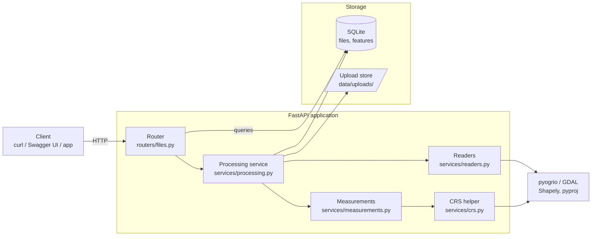
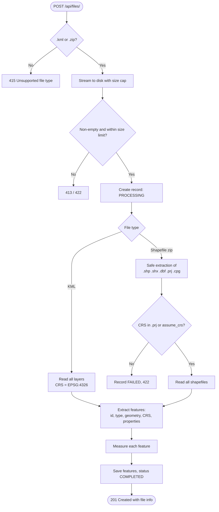
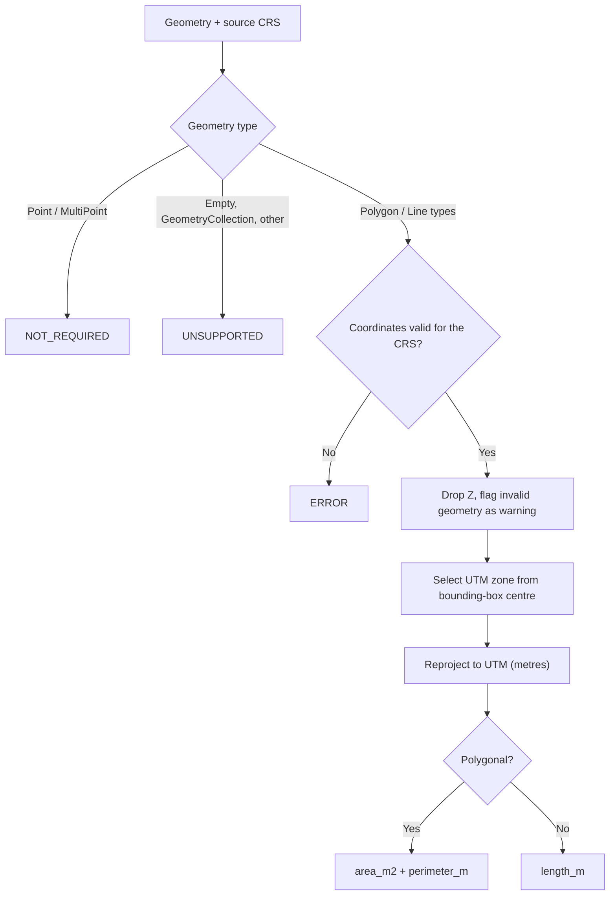
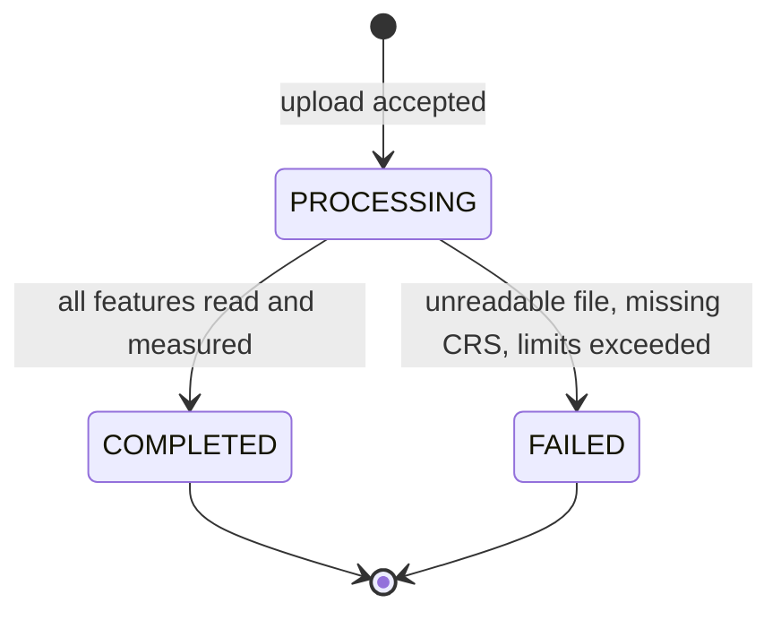
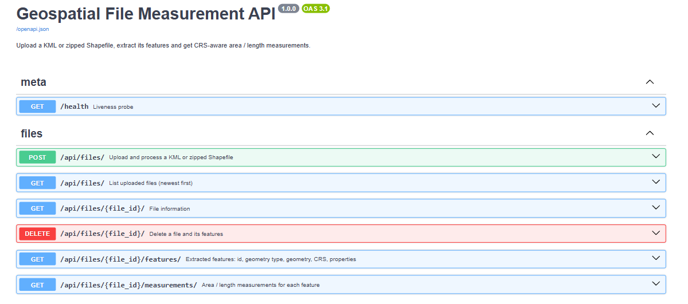
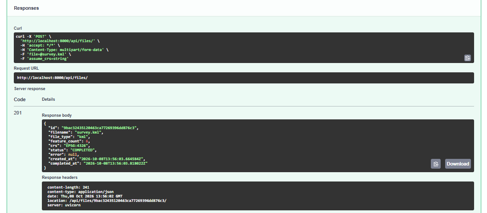
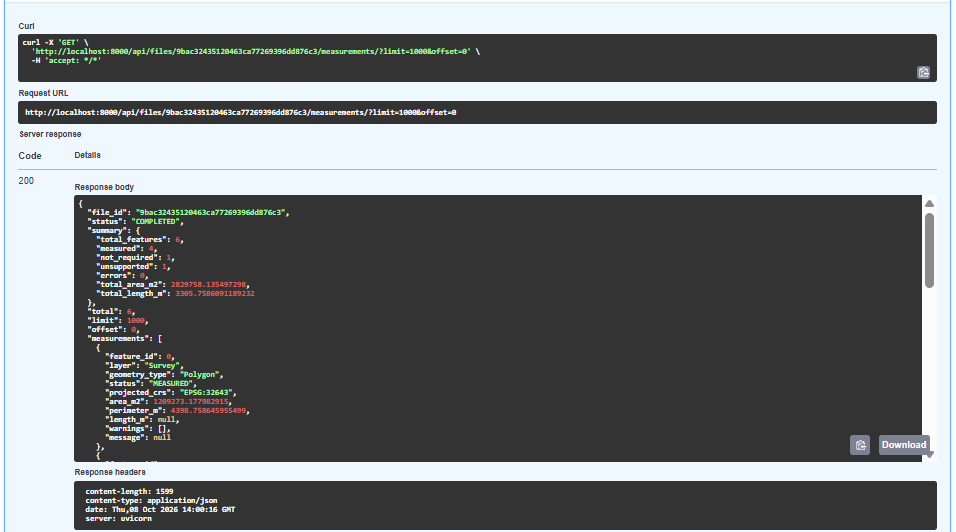
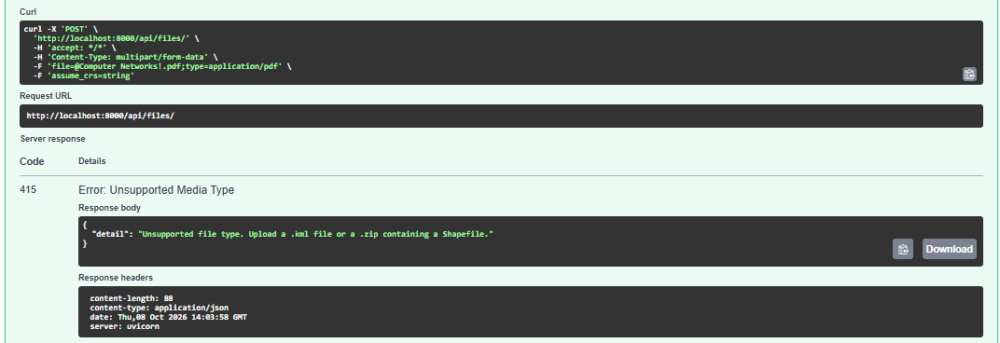
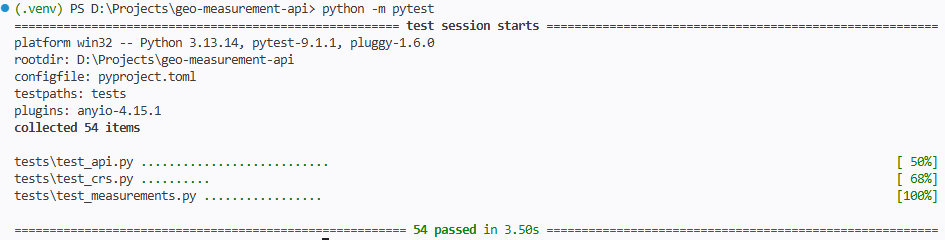

# Geospatial File Measurement API

A FastAPI backend that accepts a **KML** file or a **zipped Shapefile**, extracts every feature, and returns
**accurate area and length measurements** in square metres and metres.

- Polygon → area and perimeter · LineString → length · Point → no measurement
- Unsupported geometries are reported, never a crash
- Measurements are never taken in degrees: every feature is reprojected to a local projected CRS first

---

## Contents

1. [Tech stack](#1-tech-stack)
2. [Architecture](#2-architecture)
3. [Approach and methodology](#3-approach-and-methodology)
4. [Process flows](#4-process-flows)
5. [Project structure](#5-project-structure)
6. [Getting started](#6-getting-started)
7. [API reference](#7-api-reference)
8. [Sample output](#8-sample-output)
9. [Testing](#9-testing)
10. [How to evaluate](#10-how-to-evaluate)
11. [Design decisions](#11-design-decisions)
12. [Limitations](#12-limitations)
13. [Troubleshooting](#13-troubleshooting)

---

## 1. Tech stack

| Purpose | Technology |
|---|---|
| Web framework | FastAPI, Uvicorn |
| File reading (KML + Shapefile) | pyogrio (bundles GDAL) |
| Geometry and measurement | Shapely |
| CRS transformation | pyproj (bundles PROJ) |
| Persistence | SQLAlchemy + SQLite (any SQLAlchemy URL works) |
| Configuration | pydantic-settings |
| Testing | pytest, httpx |

No system GDAL or PROJ installation is needed; all geospatial libraries install from binary wheels.

---

## 2. Architecture



| Layer | Responsibility |
|---|---|
| **Router** | HTTP only: validation of parameters, status codes, response models. No business logic. |
| **Processing service** | Orchestrates the pipeline: store → read → measure → persist. Owns file status. |
| **Readers** | Turns a KML or zipped Shapefile into plain feature records. Handles safe zip extraction. |
| **Measurements** | Pure function `measure_geometry(geometry, crs)`: no I/O, never raises. |
| **CRS helper** | Chooses the projected CRS and caches transformers. |
| **Storage** | One row per file, one row per feature (GeoJSON geometry, properties, measurement columns). |

---

## 3. Approach and methodology

### 3.1 Problem

Uploaded survey files usually store coordinates as longitude/latitude (EPSG:4326). One degree is a different
distance depending on where you are, so area or length computed on degrees is meaningless:

> A 0.01° × 0.01° square near 11°N is about **1,209,000 m²**. Computed on raw coordinates it gives **0.0001 "square degrees"**.

### 3.2 Approach

1. **Read** the file with one library that supports both formats (pyogrio/GDAL) instead of hand-parsing XML.
2. **Normalise** every feature into the same record: index, layer, geometry type, GeoJSON geometry, CRS, properties.
3. **Reproject** each geometry to a local metric CRS.
4. **Measure** in that CRS using standard planar geometry.
5. **Persist** the results so they can be queried, paginated and summarised without re-reading the file.

### 3.3 CRS methodology

| Step | Rule |
|---|---|
| Source CRS | KML: always EPSG:4326 (by specification). Shapefile: from `.prj`, or from the `assume_crs` field if `.prj` is missing; otherwise rejected |
| Representative point | Centre of the feature's bounding box, converted to WGS84 lon/lat |
| Target CRS | UTM zone of that point: EPSG:326xx (north) or EPSG:327xx (south) |
| Polar regions | Beyond 84°N / 80°S use UPS: EPSG:32661 / EPSG:32761 |
| Projected inputs | Also reprojected (e.g. Web Mercator inflates areas), so results never depend on the input projection |

The CRS actually used is returned on every measurement as `projected_crs`, so results can be audited.

### 3.4 Measurement rules

| Geometry | Result | Status |
|---|---|---|
| Polygon, MultiPolygon | `area_m2`, `perimeter_m` (holes subtracted from area, included in perimeter) | `MEASURED` |
| LineString, MultiLineString | `length_m` | `MEASURED` |
| Point, MultiPoint | none | `NOT_REQUIRED` |
| Missing / empty geometry, GeometryCollection, other | none, with an explanatory message | `UNSUPPORTED` |
| Coordinates out of range for the CRS, or measurement failure | none, with message | `ERROR` |

Failures are isolated per feature: one problematic feature never fails the whole file.
Invalid geometries (e.g. self-intersecting polygons) are still measured and flagged in `warnings`.

### 3.5 Validation methodology

Tests compare the API against an **independent reference** that uses no map projection:
`pyproj.Geod` (ellipsoidal geodesic calculation). The sample polygon measures 1,209,273 m² through the API
against 1,208,861 m² from the reference, a 0.03% difference.

---

## 4. Process flows

### 4.1 Upload and processing



### 4.2 Measurement of one feature



### 4.3 File status lifecycle



---

## 5. Project structure

```
geo-measurement-api/
├── app/
│   ├── main.py              # ASGI entrypoint (uvicorn app.main:app)
│   ├── factory.py           # create_app(): settings, DB, routes, error handler
│   ├── config.py            # Settings (GEO_* environment variables)
│   ├── database.py          # SQLAlchemy engine and sessions
│   ├── models.py            # UploadedFile, Feature, status enums
│   ├── schemas.py           # Pydantic response models
│   ├── errors.py            # Domain errors with HTTP status codes
│   ├── routers/files.py     # /api/files endpoints
│   └── services/
│       ├── processing.py    # Upload → read → measure → persist
│       ├── readers.py       # KML / Shapefile reading, safe zip extraction
│       ├── crs.py           # CRS labels, UTM selection, transformer cache
│       └── measurements.py  # Geometry → area / length
├── tests/                   # 54 tests (unit + API)
├── scripts/make_sample_data.py
├── sample_data/             # survey.kml, plots_wgs84.zip, square_utm43n.zip
├── docs/images/             # screenshots and demo GIF for this README
├── requirements.txt / requirements-dev.txt
└── pyproject.toml           # pytest configuration
```

---

## 6. Getting started

**Prerequisites:** Python 3.10 or newer. Developed and tested on Python 3.13 (Linux).

### Install

```bash
cd geo-measurement-api
python3 -m venv .venv
source .venv/bin/activate            # Windows PowerShell: .venv\Scripts\Activate.ps1
pip install -r requirements-dev.txt
```

### Run

```bash
uvicorn app.main:app --reload --port 8000
```

| URL | Purpose |
|---|---|
| http://127.0.0.1:8000/docs | Swagger UI (upload files from the browser) |
| http://127.0.0.1:8000/redoc | ReDoc |
| http://127.0.0.1:8000/health | Health check |

The first start creates `./data/` (SQLite database and stored uploads). Delete the folder to reset.

### Configuration (optional)

Set as environment variables or in a `.env` file.

| Variable | Default | Meaning |
|---|---|---|
| `GEO_DATA_DIR` | `data` | Folder for the database and uploads |
| `GEO_DATABASE_URL` | SQLite in `GEO_DATA_DIR` | Any SQLAlchemy URL |
| `GEO_MAX_UPLOAD_MB` | `50` | Maximum upload size |
| `GEO_MAX_UNZIPPED_MB` | `200` | Maximum uncompressed zip size |
| `GEO_MAX_ZIP_MEMBERS` | `200` | Maximum files inside a zip |
| `GEO_MAX_FEATURES` | `200000` | Maximum features per file |

### Quick try

```bash
python -m scripts.make_sample_data                                    # regenerate sample files (optional)

curl -s -F "file=@sample_data/survey.kml" http://127.0.0.1:8000/api/files/
ID=<id from the response>
curl -s http://127.0.0.1:8000/api/files/$ID/
curl -s http://127.0.0.1:8000/api/files/$ID/measurements/
```

---

## 7. API reference

Paths work with or without a trailing slash. Errors are JSON: `{"detail": "...", "file_id": "..."}`
(`file_id` appears when a `FAILED` record was kept).

| Method | Endpoint | Description |
|---|---|---|
| `POST` | `/api/files/` | Upload and process a `.kml` or `.zip` (Shapefile) |
| `GET` | `/api/files/{id}/` | File information |
| `GET` | `/api/files/{id}/measurements/` | Measurements per feature, with a file summary |
| `GET` | `/api/files/{id}/features/` | Extracted features: id, geometry type, geometry, CRS, properties |
| `GET` | `/api/files/` | List uploaded files |
| `DELETE` | `/api/files/{id}/` | Delete a file and its features |

### POST `/api/files/`

`multipart/form-data`

| Field | Required | Description |
|---|---|---|
| `file` | yes | `.kml`, or `.zip` containing a Shapefile |
| `assume_crs` | no | CRS to use when a Shapefile has no `.prj`, e.g. `EPSG:4326` |

Response `201 Created`:

```json
{
  "id": "5dea4242108341b78b1adfe4b3c01123",
  "filename": "survey.kml",
  "file_type": "kml",
  "feature_count": 6,
  "crs": "EPSG:4326",
  "status": "COMPLETED",
  "error": null,
  "created_at": "2026-10-08T08:05:25.973772Z",
  "completed_at": "2026-10-08T08:05:25.983454Z"
}
```

| Code | Cause |
|---|---|
| 413 | File larger than `GEO_MAX_UPLOAD_MB` |
| 415 | Extension is not `.kml` or `.zip` |
| 422 | Empty or corrupt file, zip without `.shp`, unsafe zip paths, no CRS and no `assume_crs`, too many features |

### GET `/api/files/{id}/`

Returns the same object as the upload response. `status` is `PROCESSING`, `COMPLETED` or `FAILED`
(with the reason in `error`). `crs` is `MIXED` if layers use different CRSs. `404` for an unknown id.

### GET `/api/files/{id}/measurements/`

Query parameters: `geometry_type` (optional filter), `limit` (default 1000), `offset`.
`summary` always covers the whole file. `409` if the file is not `COMPLETED`.

```json
{
  "file_id": "5dea4242108341b78b1adfe4b3c01123",
  "status": "COMPLETED",
  "summary": {
    "total_features": 6, "measured": 4, "not_required": 1, "unsupported": 1, "errors": 0,
    "total_area_m2": 2829758.14, "total_length_m": 3305.76
  },
  "total": 6, "limit": 1000, "offset": 0,
  "measurements": [
    {
      "feature_id": 0, "layer": "Survey", "geometry_type": "Polygon",
      "status": "MEASURED", "projected_crs": "EPSG:32643",
      "area_m2": 1209273.18, "perimeter_m": 4398.76, "length_m": null,
      "warnings": [], "message": null
    },
    {
      "feature_id": 5, "layer": "Survey", "geometry_type": "GeometryCollection",
      "status": "UNSUPPORTED", "projected_crs": null,
      "area_m2": null, "perimeter_m": null, "length_m": null,
      "warnings": [], "message": "Geometry type 'GeometryCollection' is not supported for measurement."
    }
  ]
}
```

(Trimmed: the real response lists all features.)

### GET `/api/files/{id}/features/`

Query parameters: `limit` (default 100), `offset`.

```json
{
  "file_id": "5dea4242108341b78b1adfe4b3c01123",
  "total": 6, "limit": 100, "offset": 0,
  "features": [
    {
      "id": 0,
      "layer": "Survey",
      "geometry_type": "Polygon",
      "geometry": {"type": "Polygon", "coordinates": [[[76.97, 11.0], [76.97, 11.01], [76.96, 11.01], [76.96, 11.0], [76.97, 11.0]]]},
      "crs": "EPSG:4326",
      "properties": {"Name": "Plot A", "description": "Rice field"}
    }
  ]
}
```

`id` is a 0-based index, stable within the file. `geometry` is GeoJSON in the file's original CRS.
Null properties are omitted; GDAL's KML styling columns are dropped.

---

## 8.output

### 8.1 Swagger UI



### 8.2 Upload response



### 8.3 Measurements response



### 8.4 Error handling

  

### 8.5 Test results




### 8.6 Expected results for the sample files

| File | Feature | Expected |
|---|---|---|
| `survey.kml` | 0 Plot A (Polygon) | `area_m2` ≈ 1,209,273 in `EPSG:32643` |
| `survey.kml` | 1 Plot B (Polygon with hole) | `area_m2` ≈ 1,015,813 (about 16% less than Plot A because of the hole) |
| `survey.kml` | 2 Parcels (MultiPolygon) | `area_m2` ≈ 604,672 |
| `survey.kml` | 3 Access road (LineString) | `length_m` ≈ 3,305.8 |
| `survey.kml` | 4 Borewell (Point) | `NOT_REQUIRED` |
| `survey.kml` | 5 Mixed (GeometryCollection) | `UNSUPPORTED`, other features still measured |
| `square_utm43n.zip` | 100 m × 100 m square in metres | `area_m2` = 10000.0 |

---

## 9. Testing

```bash
source .venv/bin/activate
python -m pytest                       # all tests, about 3 seconds
python -m pytest -v                    # one line per test
python -m pytest tests/test_api.py     # one file
python -m pytest -k "zip"              # tests matching a name
```

Expected result: `54 passed`. Every test uses its own temporary database and upload folder, so tests are isolated
and never touch `./data`.

| File | Covers |
|---|---|
| `test_crs.py` | UTM zone selection: north/south, antimeridian, polar fallback, projected input |
| `test_measurements.py` | Area and length against the geodesic reference (within 0.1%); holes; multi-geometries; Z values; points; GeometryCollection and empty geometry; invalid polygons; Web Mercator correction; mislabelled CRS |
| `test_api.py` | Upload, info, features and measurements for KML and Shapefile; multiple KML folders; pagination and filters; list and delete; error codes 404/409/413/415/422; zip-slip rejection; missing `.prj` with and without `assume_crs` |

---

## 10. How to evaluate

### 10.1 Requirement checklist

| Requirement | Where implemented | How to verify |
|---|---|---|
| FastAPI backend | `app/factory.py` | Start the server, open `/docs` |
| Upload `.zip` Shapefile and `.kml` | `routers/files.py`, `services/processing.py` | `test_upload_kml_returns_file_info`, `test_upload_shapefile_zip` |
| Extract ID, geometry type, geometry, CRS, properties | `services/readers.py` | `test_features_expose_id_type_geometry_crs_properties` |
| Graceful handling of unsupported geometry | `services/measurements.py` | `test_unsupported_geometry_is_handled_gracefully` |
| Polygon area, LineString length, Point none | `services/measurements.py` | `test_measurements_for_kml` |
| Reproject before measuring | `services/crs.py` | `test_polygon_area_matches_geodesic_reference`, `test_area_is_not_computed_in_degrees` |
| `GET /api/files/{id}/` and `/measurements/` | `routers/files.py` | `test_get_file_info`, `test_measurements_*` |

### 10.2 Verify the numbers independently

```bash
python - <<'EOF'
from pyproj import Geod
from shapely.geometry import box
area, perimeter = Geod(ellps="WGS84").geometry_area_perimeter(box(76.960, 11.000, 76.970, 11.010))
print(abs(area), perimeter)     # 1208861.2  4398.0
EOF
```

The API reports 1,209,273.2 m² and 4,398.8 m for the same polygon (0.03% and 0.02% difference),
which is the expected scale distortion of UTM inside a zone.

### 10.3 Try failure cases

```bash
curl -s -F "file=@README.md" http://127.0.0.1:8000/api/files/                      # 415
: > empty.kml && curl -s -F "file=@empty.kml" http://127.0.0.1:8000/api/files/     # 422
curl -s http://127.0.0.1:8000/api/files/does-not-exist/                            # 404
rm -f empty.kml
```

---

## 11. Design decisions

| Decision | Reason | Alternative considered |
|---|---|---|
| FastAPI | Typed models and automatic OpenAPI docs with little code | Django + DRF: more than this API needs |
| pyogrio + Shapely + pyproj | One library reads KML and Shapefile; wheels bundle GDAL/PROJ, so `pip install` is enough | geopandas (pulls in pandas, adds nothing needed); hand-parsing KML (fragile) |
| UTM zone per feature | Under 0.1% distortion inside a zone, standard and easy to audit | Equal-area projection per feature (exact area, less familiar); geodesic maths only (skips the projected-CRS step) |
| Reproject projected inputs too | Avoids silent errors from Web Mercator and non-metre units | Trust the input CRS (faster, sometimes wrong) |
| Synchronous processing | Survey files process in milliseconds to seconds; the result is available immediately. Status values already allow moving to background jobs later | Celery or background tasks: extra infrastructure for little benefit here |
| SQLite through SQLAlchemy | No setup; switch with `GEO_DATABASE_URL` | PostGIS: a server that is not needed because measuring is done in Python |
| Per-feature status | One odd feature must not make a large survey unusable | All-or-nothing validation |
| Invalid geometry measured with a warning | Reports what the file contains without silently altering survey data | `make_valid()` (changes data) |
| Explicit `assume_crs` | Guessing a missing CRS gives plausible but wrong numbers | Assume EPSG:4326 |
| Upload hardening | Size cap, zip-slip checks, zip-bomb limits, only Shapefile parts extracted, sanitised filenames | Trust the archive |

---

## 12. Limitations

- **Request size:** the framework receives the whole upload before the size check runs. In production also limit body size at the reverse proxy (e.g. nginx `client_max_body_size`).
- **Large features:** a feature spanning several UTM zones, or a line crossing the antimeridian, is measured in a single zone, with slightly more distortion.
- **Formats:** KMZ and GeoJSON are not accepted.
- **Security:** no authentication or rate limiting; anyone who knows a file id can read it.
- **Scaling:** processing is synchronous and tables are created at startup (no migrations).

---

## 13. Troubleshooting

| Symptom | Fix |
|---|---|
| `ModuleNotFoundError: app` or `tests` | Run commands from the project root |
| `422 … declares no coordinate reference system` | Shapefile has no `.prj`; re-upload with `-F assume_crs=EPSG:4326` (or the correct code) |
| Feature `status: ERROR`, "outside the valid range" | Coordinates look projected but the CRS says lon/lat; fix the CRS or use the right `assume_crs` |
| `413` on a valid file | Raise `GEO_MAX_UPLOAD_MB` |
| `Address already in use` | Use another port: `--port 8001` |
| Reset everything | Stop the server and delete `data/` |
